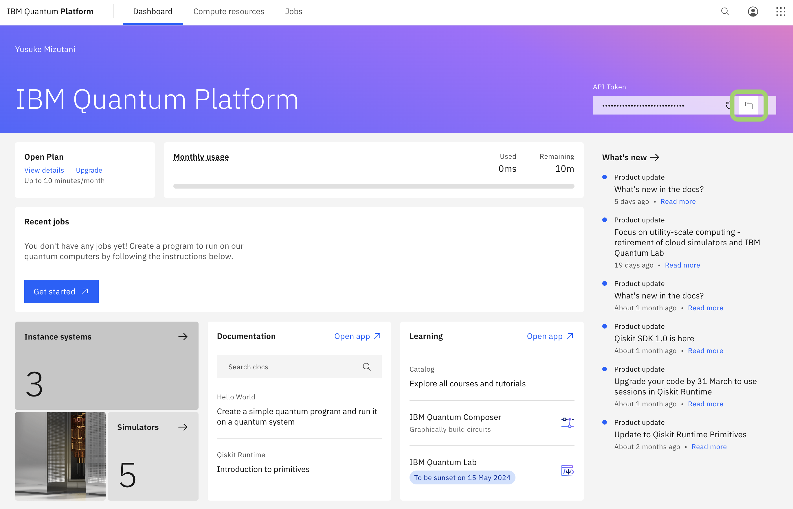

# Qiskit starter kit

## Requirements

- python 3.12
- poetry

## How to use

1. サインイン [IBM Quantum](https://quantum.ibm.com/)

2. API Token のコピー



3. このリポジトリを clone

```bash
% git clone git@github.com:wg-quantum/qiskit-starter-kit.git
% cd qiskit-starter-kit
% git fetch origin quantum-challenge
% git checkout -b quantum-challenge origin/quantum-challenge
```

4. ターミナルで以下を実行

```bash
% poetry install
```

5. API Token を各 notebook へ記入

6. notebook を実行
